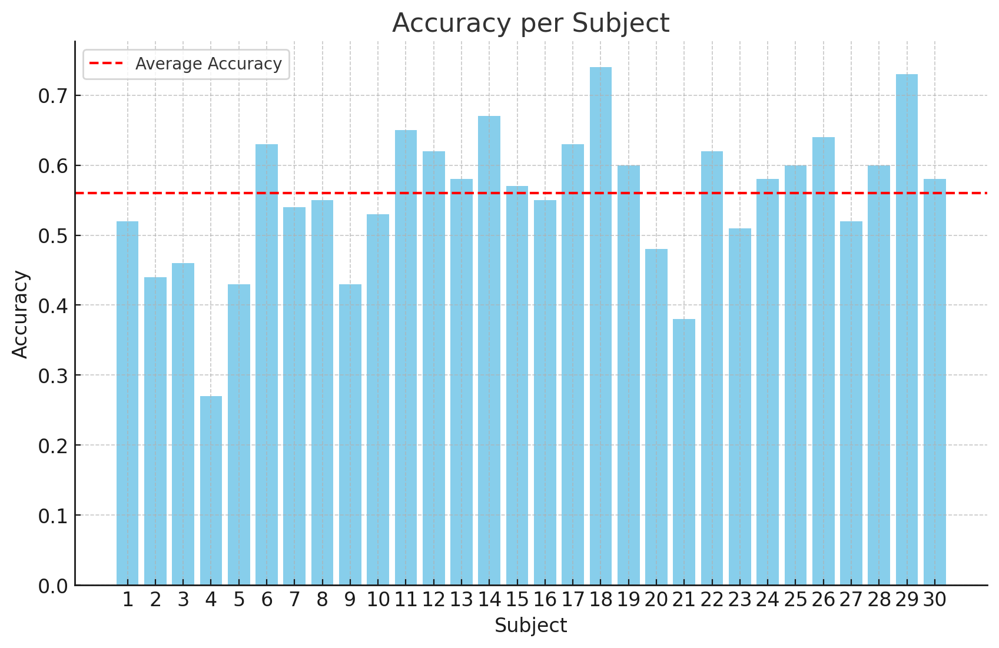
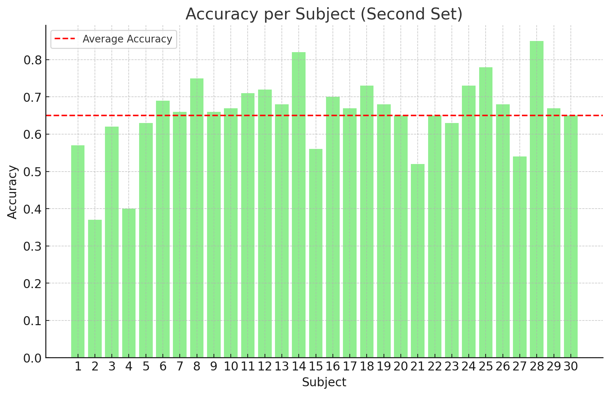

# Skeleton-Based Human Action Recognition through Third-Order Tensor Representation and Spatio-Temporal Analysis

This repo aims to replicate following methodology:

## Unofficial MATLAB Implementation for Skeleton-based Human Activity Recognition (HAR)

This repository provides an unofficial implementation of a skeleton-based HAR algorithm inspired by the paper "[Skeleton based HAR](inventions-04-00009-v2.pdf)" (Croatian).

## Tutorial for usage

- Clone the repo and make sure the dataset is placed according to the needs and include start/end sequences annotation from [this link](http://www.eng.alexu.edu.eg/mehussein).

- First, run the script `skel_model.m` to include the relevant variables in the Workspace.

- Next, run the script `construct_codebook.m` to create tensors where the feature vectors for the creation of codebooks will be placed.

- Once the relevant frames for codebook construction are extracted, proceed to building the codebook using k-means and the final extraction of features. Run the script `extract_features.m` with the desired configuration to extract the Spatial and Temporal features for each sequence.

- For evaluation as in the paper, use the script `splitMSRC12Dataset.m`, which loads all files performed by a specified subject. The evaluation script is named `leave_person_out_protocol.m`.

- Instead of using DCA and ANN classifier, I found that the best performance is yielded by the Random Forests algorithm on the `single` descriptors. I used 1000 trees.

Following are the obtained results and the comparison to the results obtained by the authors:

## Results

Based on the "leave persons out procedure", I obtained the following results:

These results were obtained using the following hyperparameters:

- (x,y,h) = (13,13,15)
- number_of_singular_values = 13

### Codebook Construction

- K = 32 codes in the codebook
- L1 distance used for construction of codebooks `cityblock`
- There is generally high variance, i.e., local optima are of relatively similar quality

### Preprocessing of Skeleton

- Aligning the coordinate system based on the hip center
- Scaling based on spine length
- Rotation in the direction of the z-axis, i.e., vector [0 0 1]
- Finally, scaling coordinates to fit in a binary tensor of third order
- 1000 Trees in the Random Forests classifier

Unfortunately, the authors did not provide the methodology on the construction of both the Codebook and descriptors, thus many details are left in the air. I assumed the separate frames represent centers in the codebook, but in some literature, they point out that multiple frames concatenated can be used as well. I implemented a pipeline for extraction of features based on windows; the scripts are named `{regular_name}_window` and the additional hyperparameters are `hop_length` and `window_size`, which have standard meaning.

There is a possibility that the authors used only a fragment of the original set, i.e., ~1600 samples since they referred to the paper where only Video instructed sequences were used.

Feel free to suggest improvements via the issues section.

Thank you for reading. Cheers!

