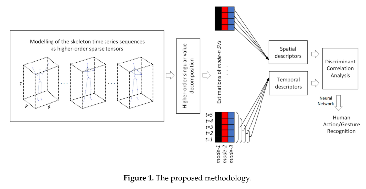

# Human Action Recognition

This repo aims to replicate following methodology:

Here, I bring non official implementation of algorithm based on paper # inventions-04-00009-v2.pdf. Coding is done in MATLAB and the comments are mostly on Croatian language.
#TODO Translation

Summary:
        Here, we describe Multimodal approach for Human action recognition using tensor decomposition and ANN. Furthermore, the comparison with Random Forests approach is included as well
