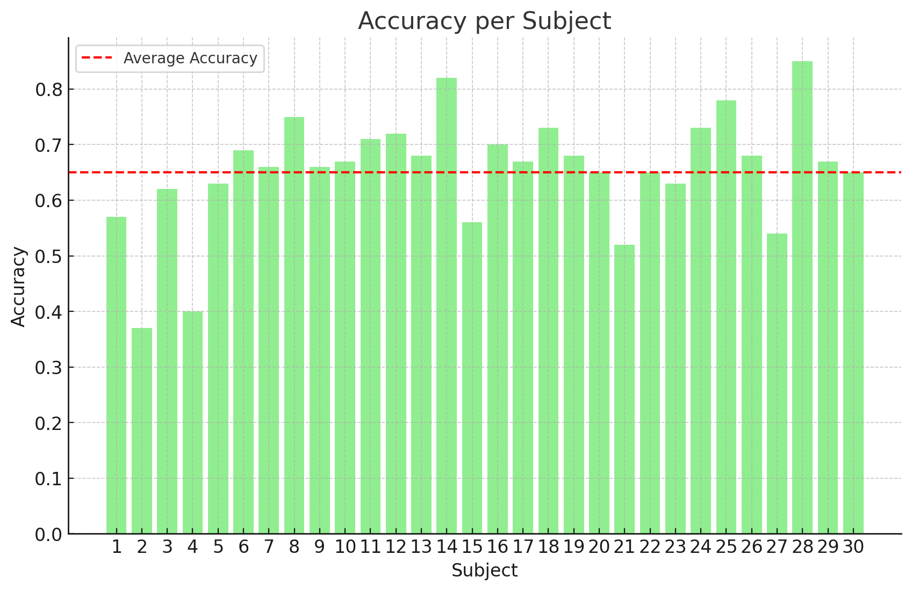

# Skeleton-Based Human Action Recognition through Third-Order Tensor Representation and Spatio-Temporal Analysis

This repo aims to replicate following methodology:

## Unofficial MATLAB Implementation for Skeleton-based Human Activity Recognition (HAR)

This repository provides an unofficial implementation of a skeleton-based HAR algorithm inspired by the paper "[Skeleton based HAR](inventions-04-00009-v2.pdf)" (Croatian).

## Tutorial for usage
    - Clone the repo and make sure the dataset is placed according to the needs and include start/end sequences annotation from link http://www.eng.alexu.edu.eg/mehussein
    - One should firstly run script `skel_model.m` so to include the relevant variables in the Workspace
    - Script `construct_codebook.m` should be ran so as to create tensors where the feature vectors for the creation of codebooks will be placed.
    - Once the relevant frames for codebook construction are extracted, we can proceed to building codebook using k-means and final extraction of features; Run script `extract_features.m` with config as desired so to extract the Spatial and Temporal features for each sequence
    - For evaluation as in paper, I implemented script `splitMSRC12Dataset.m` which helps to load all files performed by specified subject. The evaluation script is named `leave_person_out_protocol.m`. 
    - Instead of using DCA and ANN classifier, I found that the best performance is yielded by Random Forests algorithm on the `single` descriptors. I used 1000 trees.

Following are obtained results and the comparison to the results obtained by authors:

## Results
Based on the "leave persons out procedure", I obtained following results:

